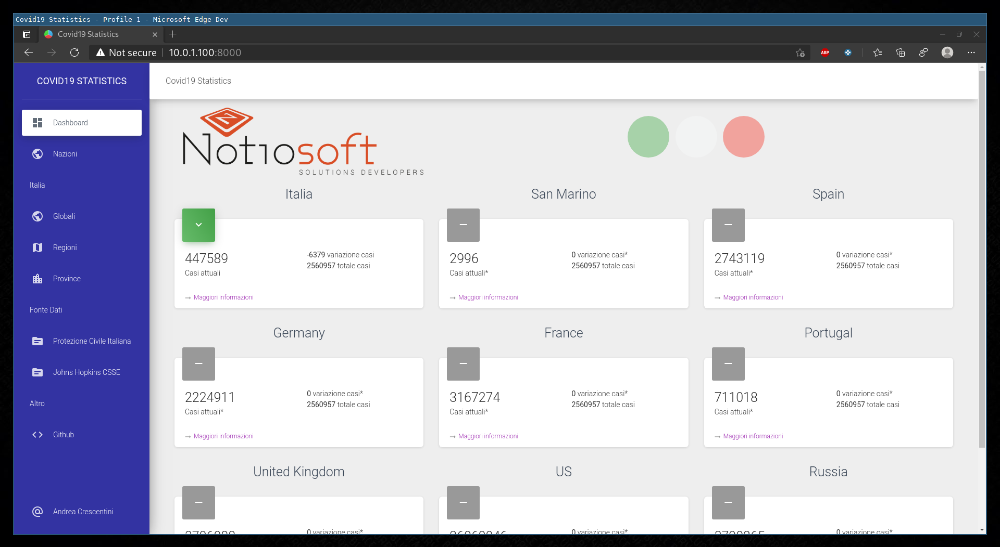

# Covid19_Statistics

## Dettagli Progetto:

Lo scopo del progetto è quello di creare un inferfaccia di visualizzazione completa dei dati resi a disposizione dalla Protezione Civile, ISS Repubblica di San Marino e Johns Hopkins University Center for Systems Science and Engineering mediante formato CSV. Si vuole anche creare grafici completi per i dati e le loro elaborazioni più comuni.

Scopo ulteriori è quello di mantenere online una copia funzionante del progetto con dati aggiornati quotidianamente fino al termine dell'attuale emergenza. Tale punto si realizzaerà quando si ritterrà la piattaforma sufficientemente matura. 

Sito Consultabile: https://covid19.andreacrescentini.com/ e https://covid19.notiosoft.com/

## Task aperte:
- [ ] Migliorare visualizzazioni grafici. Visto l'espandersi della finestra temporale risultano difficilmente consultabili nella loro interezza.
- [ ] Migliorare rendering tabelle. Visto l'aumentare della mole di dati è necessaria una tabella paginata e più versatile.

## Task completate:

- [x] Visualizzazione dati per provincia
- [x] Visualizzazione dati per regione
- [x] Visualizzazione dati nazionali
- [x] Visualizzazione grafici per provincia
- [x] Visualizzazione grafici per regione
- [x] Visualizzazione grafici nazionali
- [x] Pubblicazione piattaforma per la consultazione dei dati
- [x] Gestione note correlate ai rilevamenti
- [x] Raccolta dati provenienti dagli OpenData UE
- [x] Raccolta dati provenienti dall'ISS - Repubblica di San Marino
- [x] Dismissione dati provenienti dagli OpenData UE
- [x] Raccolta dati provenienti dal Johns Hopkins University Center for Systems Science and Engineering
- [x] Ripristino struttura dati proveniente dall'ISS - Repubblica di San Marino (Non più conforme con il formato inizialmente utilizzato)
- [x] Ripristino struttura dati proveniente dalla Protezione Civila Italiana
- [ ] ~~Potenziare i dati delle provincie con le elaborazioni complete machine readable dei PDF forniti della Protezione Civile~~

## Link utili
* **Laravel** (Framework) https://laravel.com/
* **Okipa/laravel-table** https://github.com/Okipa/laravel-table
* **Plotly JS** https://plotly.com/javascript/
* **pcm-dpc/COVID-19** (Dati Protezione Civile) https://github.com/pcm-dpc/COVID-19 
* **Johns Hopkins University Center for Systems Science and Engineering** https://github.com/CSSEGISandData/COVID-19
* ~~**TinBòta - Dati Coronavirus (RSM)** https://tinbota.github.io/~~
* ~~**ondata/covid19italia**~(Conversione machine readable dati PDF) https://github.com/ondata/covid19italia~~ (dati non più generati)
* ~~**Opendata UE - COVID-19** https://data.europa.eu/euodp/it/data/dataset/covid-19-coronavirus-data/resource/260bbbde-2316-40eb-aec3-7cd7bfc2f590~~ (dati troppo discostati dalla realtà. necessaria nuova fonte)
